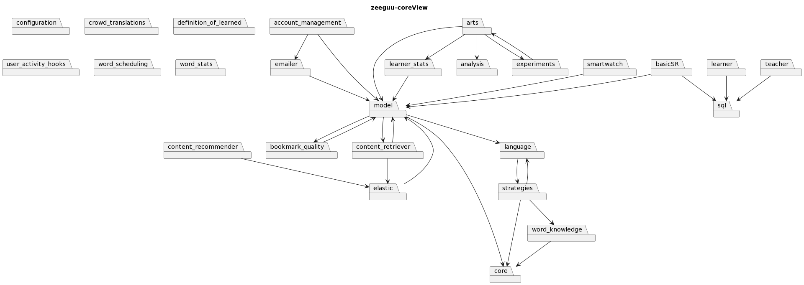

# MT-Diagrams

MT-diagrams is a software tool designed for Python systems that enables you to create visual package views. These views display the various packages included in your system and their dependencies. With MT-diagrams, you have the flexibility to include or exclude specific packages based on your requirements.

For illustration purposes, we'll use the [Zeeguu](https://github.com/zeeguu/api) GitHub project as an example. The following diagram highlights the core packages included in the project.




In addition, the system can identify and highlight the differences between your working branch and a specified remote branch, including added or removed dependencies, as well as created or deleted packages.

To demonstrate this functionality, take a look at the following view that illustrates the differences between two branches in the Zeeguu project.


## Installation

To install mt-diagrams, simply use the pip package manager by running the following command:

`pip install mt-diagrams` (You might need administrative right to perform the operation)

This will download and install the necessary files and dependencies needed for mt-diagrams to run properly.

## Setup

To get started run the command `mt-diagrams create-config` this will create a basic config file defining a basic view that will showcase all packages included in the system

Below you can see the basic config file created

```json
{
    "$schema": "https://raw.githubusercontent.com/Perlten/MT-diagrams/master/config.schema.json",
    "name": "",
    "rootFolder": "",
    "github": {
        "url": "",
        "branch": "main"
    },
    "saveLocation": "./diagrams/",
    "views": {
        "completeView": {
            "packages": [],
            "ignorePackages": []
        }
    }
}
```

For mt-diagrams to work you will need to fill the fields `name` and `rootFolder`.

- `name`: This value will be prefixed to all your diagrams.
- `rootFolder`: This points to the folder containing the root packages in your system (usually named src or similar).
- `github`: Field in the configuration file allows you to specify a remote GitHub repository and its branch to facilitate difference views
    - `url`: The url of the repository
    - `branch`: The branch for comparison
- `saveLocation`: This is the folder where created views will be saved.
- `views`: This contains a map with view names as keys and the following sub-fields: 
    - `packages`: This specifies the packages to include in the project. You provide this as a path to the folder from the rootFolder (e.g., "api.server" will point to a sub-package in the api package named server).
    - `IgnorePackages`: This is similar to packages except these will be ignored by the tool.

## CLI

The CLI tool has four available commands:

- `mt-diagrams --help`: This command provides instructions on how to use the tool and its available commands.

- `mt-diagrams render`: This command generates a package diagram based on the configuration file. This is the main command used to generate diagrams based on the provided configuration file.

- `mt-diagrams render-diff`: This command generates a package diagram highlighting differences between the working branch and the specified branch in the config file. This command is useful for comparing package dependencies between different branches in a project.

- `mt-diagrams create-config`: This command generates a basic configuration file defining a view that showcases all packages included in the system. This command is useful for quickly generating a configuration file to get started with the tool. This command should be run in the root of your project
