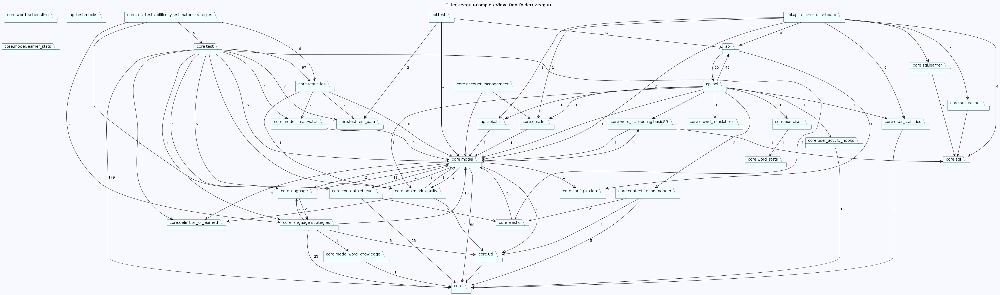
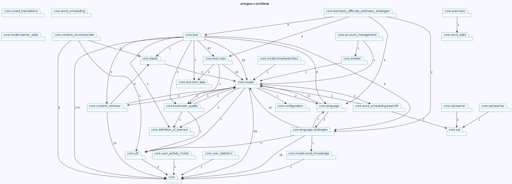
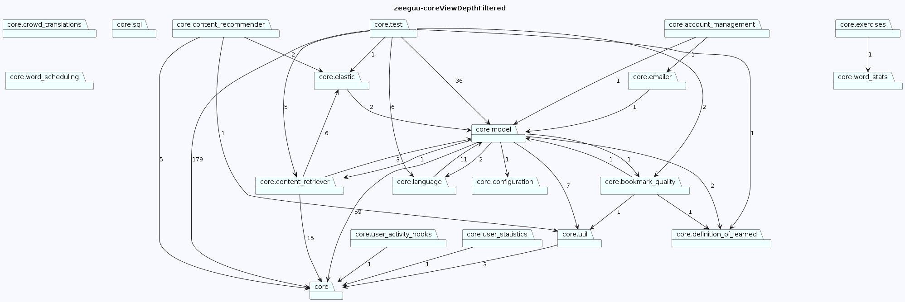
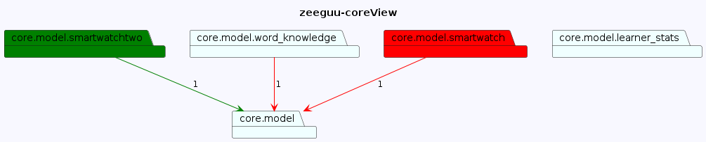
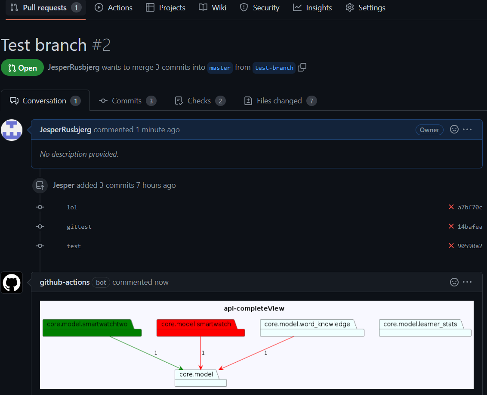

# Architectural Lens

Architectural-Lens is a Python software tool that generates customizable visual package views, showcasing the packages in your system and their dependencies. It offers the flexibility to include or exclude specific packages to suit your requirements for comprehensible views.

Moreover, Architectural-Lens can highlight the differences between your working branch and a specified remote branch, including added or removed dependencies and created or deleted packages, by using green and red highlighting.

Lastly, Architectural-Lens can display the highlighted differences in the system views when a pull request is created on GitHub. It automatically generates the views specified in your config, highlights the differences, and displays them in your pull request, simplifying the review process.

To help you get started, this readme includes various options in combination with the setup of a config file.

### Runs on Python 3.9, 3.10, 3.11

## Installation

To install Architectural-Lens, simply use the pip package manager by running the following command:

`pip install Architectural-Lens` (You might need administrative right to perform the operation)

This will download and install the necessary files and dependencies needed for Architectural-Lens to run properly.

## Commands

All commands must be run from the project's root folder

<b>The system has 4 commands:</b> 


-`archlens init`- Creates the config template

-`archlens render` - Renders the views specified in the config

-`archlens render-diff` - Renders the differences in the views between your working branch and a specified branch

-`archlens create-action` Creates the github action which will automatically add the difference views to pull requests.

# Using the system

In this section, we will guide you through using the Architectural-Lens system by explaining the commands and output with the example of an API project called 'zeeguu-api' that can be found at https://github.com/zeeguu/api.

Although the project is not large, understanding the system even for this project size of roughly 40 packages can be challenging. To begin generating views, you need to be in the root of your project and run the following command:

- `archlens init` 

This will create an "archlens.json" file in your root folder, where you can edit your desired views. This is the initial config:

```json
 {
    "$schema": "https://raw.githubusercontent.com/Perlten/Architectural-Lens/master/config.schema.json",
    "name": "",
    "rootFolder": "",
    "github": {
        "url": "",
        "branch": "main"
    },
    "saveLocation": "./diagrams/",
    "views": {
        "completeView": {
            "packages": [],
            "ignorePackages": []
        }
    }
}

```

Here are two views of the 'zeeguu-api' project that we will be using as examples:

- A complete view of the system



Hard to grasp? Architectural-Lens agrees with you, which is why this tool exists.

- A view of the system where everything except "core" and its sub-packages has been scraped away:



Here is an edited version of the "archlens.json" file for the 'zeeguu-api' project, which represents the first two views we created earlier, along with comments explaining each field briefly:

The "views" field in the "archlens.json" file allows you to define as many views as you need for your project. Simply add a new object with a unique name for each view you want to create. For example, if you wanted to create a view that showed only the "utils" package in the "api" folder, you could add the following to the "views" field:

```json
{
    "$schema": "https://raw.githubusercontent.com/Perlten/Architectural-Lens/master/config.schema.json",
    "name": "zeeguu", # Name of project
    "rootFolder": "zeeguu", # Name of source folder containing the root package (Usually a folder called src)
    "github": {
        "url": "https://github.com/zeeguu/api", # Link to project's Github
        "branch": "master" # Name of main/master branch of project
    },
    "saveLocation": "./diagrams/", # Location to store generated diagrams
    "views": { # Define each view
        "completeView": { # Name of first view, you may add more
            "packages": [], # Select packages to see in view, if left empty, see entire system view
            "ignorePackages": [] # Specify packages not to include in diagram
        }, "coreView":{ # Create view containing specific packages
            "packages": [
                "core" # In this case, we only allow packages starting with the name 'core'
            ],
            "ignorePackages": []
        }
    }
}

```

### You can render the views specified in your "archlens.json" file by running the command:
- `archlens render`

This will generate the diagrams for all the views defined in your configuration file and save them in the location specified in the "saveLocation" field of your configuration.

## Further Filtering of packages

If you find the core view to be too large, you can create a new view that further filters the packages. Instead of giving a path to the package "core", you can limit it further by specifying that you want to see "core" and only its sub-packages that are 1 layer down.

To achieve this, you can create an object instead of a string path for the package, with two fields: "depth" and "packagePath". In the "depth" field, you specify the number of sub-packages you want to include, and in the "packagePath" field, you specify the package to start with.

For example, the following configuration file defines a view for the "core" package and its immediate sub-packages:



This will create a view that shows only the "core" package and its immediate sub-packages.

Here is an example of the archlens.json file used to generate the filtered view:

```json
{
    "$schema": "https://raw.githubusercontent.com/Perlten/Architectural-Lens/master/config.schema.json",
    "name": "zeeguu", 
    "rootFolder": "zeeguu", 
    "github": {
        "url": "https://github.com/zeeguu/api", 
        "branch": "master" 
    },
    "saveLocation": "./diagrams/", 
    "views": { 
         "coreView":{ 
            "packages": [
                #We create an object instead of a path
                 {
                    "depth": 1, #We only want 1 layer of sub packages from core
                    "packagePath": "core" #Just like before, we give the path
                } 
            ],
            "ignorePackages": []
        }
    }
}

```

You can combine both strings and objects when defining packages in the packages array in the configuration file. For example, you can include all packages starting with "api/utils" along with packages in the "core" directory up to a depth of 1 using the following syntax:

```json

"packages": [
    "api/utils",
    {
    "packagePath": "core",
    "depth": 1
    }
 ]

```

## Arrows
Each arrow in the system diagram represents a dependency between two packages, and the number on the arrow indicates the number of dependencies going in that direction. If you prefer not to see these arrows, you can use the optional "showDependencyCount" setting, which is a boolean. When set to "false", the dependency count will be hidden in all views. Here is an example of how to set this option in your archlens.json file:

```json
{
    "$schema": "https://raw.githubusercontent.com/Perlten/Architectural-Lens/master/config.schema.json",
    "name": "zeeguu", # Name of project
    "rootFolder": "zeeguu", # Name of source folder
    "github": {
        "url": "https://github.com/zeeguu/api", # Link to project's Github
        "branch": "master" # Name of main/master branch of project
    },
    "showDependencyCount": false, <------ here we remove the arrows.
    "saveLocation": "./diagrams/", # Location to store generated diagrams
}
```
In this mt-config file, the dependency count would be gone. This setting is applied to all of the views.   

## Ignore packages
In addition to selecting which packages you want in your diagram, you can also select which packages you want removed from your diagram.

This can be done in two different ways:

```json
"packages": [
"*test*" #Removes any package which contains the word test
"api/test" #Removes the package api/test and all of its sub packages
]
```

To clarify, the first method using an asterisk (*) will remove any package containing the specified keyword, while the second method will remove only the specified package and all of its sub-packages. This can be useful for cleaning up clutter in the diagram or for excluding certain packages that are not relevant to the analysis.

## The difference views
To generate a difference view using Architectural-Lens, you need to be on a branch other than the one specified in the configuration file. Usually, you would compare your current branch with the main/master branch, but you have the flexibility to choose any branch you desire. For the following example, I have narrowed down the view by filtering out only the "core/model" package.

```json
{
    "$schema": "https://raw.githubusercontent.com/Perlten/Architectural-Lens/master/config.schema.json",
    "name": "zeeguu", 
    "rootFolder": "zeeguu", 
    "github": {
        "url": "https://github.com/zeeguu/api", 
        "branch": "master" 
    },
    "saveLocation": "./diagrams/", 
    "views": { 
         "coreView":{ 
            "packages": [
                "core/model" #Looking at core/model, using the path instead of object, because i want to see the entire sub system
            ],
            "ignorePackages": []
        }
    }
}
```
For the next example, the core view is further filtered to show only "core/model". Three changes were made in comparison to the main branch: the package "smart_watch" was deleted, a new package called "smart_watch_two" was added, and a dependency from "word_knowledge" to "model" was removed.

To render this new view displaying the changes, a new command must be run:

- `archlens render-diff`



If there are no diffrences, a diagram without diffrences will still be generated.


## Github action - Pull request

To display the difference views in your pull requests, run the command:

- `archlens create-action`

This command generates the necessary files in the .github folder, creating it if it doesn't already exist. Once this is done, you can create a pull request, and the difference view will be visible to the reviewer, as shown in the image below. If there are no diffrences, a diagram without diffrences will still be generated.


