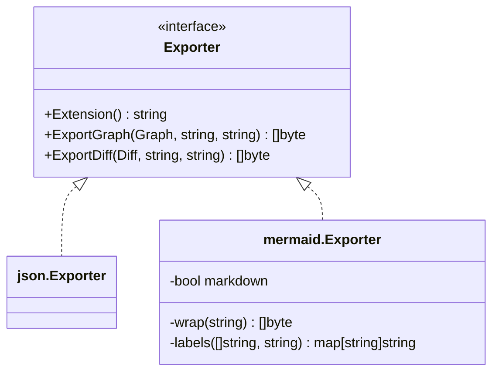

```mermaid
classDiagram
    Exporter <|.. json.Exporter
    Exporter <|.. mermaid.Exporter
    class Exporter{
      <<interface>>
      +Extension() string
      +ExportGraph(Graph, string, string) []byte
      +ExportDiff(Diff, string, string) []byte
    }
    class json.Exporter{
    }
    class mermaid.Exporter{
      -bool markdown
      -wrap(string) []byte
      -labels([]string, string) map[string]string
    }
```